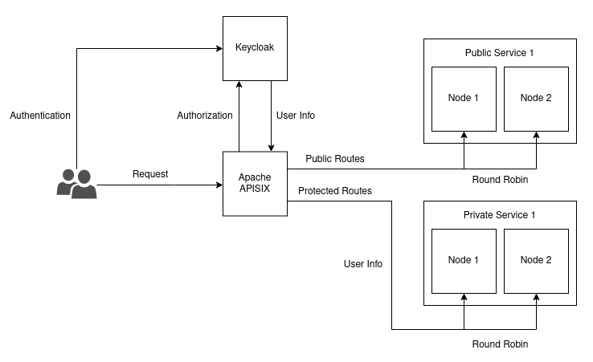
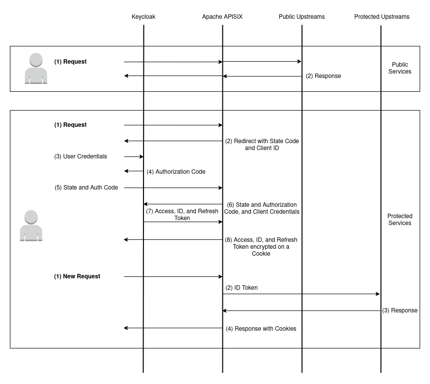

# Auth Infrastructure

This project showcases a secure infrastructure that utilizes the **Apache APISIX (API Gateway)** and the **Keycloak (IAM)** to protect API endpoints. The authentication and authorization methods employed are **OIDC** and **OAuth 2.0**, respectively.

## Overview

This project contains two services, both of them are replicated across two nodes. Through the API Gateway, each service is associated to one route. The public service is associated to `("/")` and the protected service to `("/api/")`. 

Users attempting to access the protected route are redirected to the login page to perform authentication. They also have the option to create a new account. After successful authentication, the user is redirected to the protected endpoint and granted access. The endpoints responses body contains messages indicating whether they are public or private and the node accessed.

- Infrastructure:

<p align="center">
  
</p>

- Authentication and Authorization Flow:

<p align="center">
  
</p>

## Installation

1. Clone this repository:

```
git clone https://github.com/sesaquecruz/auth-infrastructure.git
```

2. Enter the project directory:

```
cd auth-infrastructure
```

3. Start the containers (Keycloak can take about a minute to start.):

```
docker compose up -d
```

## Usage

Endpoints:

- Keycloak:

As an example of organization, the realm created was named bank. 

Please see the Troubleshooting section to understand why the `keycloak` domain needs to be used and how to set it.

```
http://keycloak:8080/realms/bank/account/
```

- Public Service:

```
http://127.0.0.1:9080/
```

- Protected Service:

```
http://127.0.0.1:9080/api/
```

## Troubleshooting:


As the containers run inside a Docker network, they are accessed using service names. So, for APISIX to connect to Keycloak, it needs to receive something like `http://keycloak:8080`, as shown below in the OIDC plugin configuration:

```
"openid-connect":{
	"client_id":"bank-api",
	"client_secret":"kZ9TTjOtalbwWdcJYmu3Hy8CfZQ9xnmD",
	"discovery":"http://keycloak:8080/realms/bank/.well-known/openid-configuration",
	"introspection_endpoint_auth_method":"client_secret_post",
	"realm":"bank",
	"redirect_uri":"http://127.0.0.1:9080/api/auth/",
	"scope":"openid profile"
}
```

The result is that when the user is redirected to the authentication page, the domain 'keycloak' is not achieved.

It is fixed creating an alias to the local address `127.0.0.1` named `keycloak`. That can be done by adding the following line to the file `/etc/hosts`:

```
127.0.0.1	keycloak
```

## Cleanup

1. To stop and remove the containers, run:

```
docker compose down
```

## Keycloak Configuration

The Keycloak instance is preconfigured with an realm and client settings. These settings can be modified by updating the [realm config file](config/keycloak/bank-realm.json).

## APISIX Configuration

The APISIX configurations, admin credentials, and etcd configurations can be found in the [config file](./config/apisix/config.yaml). The upstreams, services, and routes are created by a helper container executing the [script](./config/apisix/config.sh) that uses the APISIX Admin REST API to create them.

## Contributing

Contributions to this project are welcome. If you encounter any issues or have ideas for enhancements, feel free to open an issue or submit a pull request.

## License

This project is licensed under the MIT License. Please see the [LICENSE](./LICENSE) file for more details.